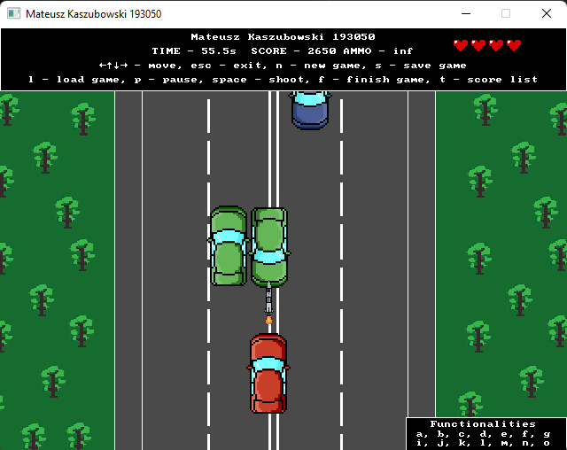

# Basics of the Atari game Spy Hunter
In this project student is expected to write desktop application of an Atari game called Spy Hunter. The
object of the game is to drive down roads and destroy other (enemy) vehicles, using the weapons that are
available for the player. The project is based on the Atari 2600 version of the game. More detailed information
is available on the [Wikipedia](https://en.wikipedia.org/wiki/Spy_Hunter). The example of the gameplay is available on [Youtube](https://www.youtube.com/watch?v=DLyJS8mlCLY).
#

# General guidelines of the project
The assignment is accompanied by a sample project (template) in which the following functionality is implemented:
- calculating the increment of time, which allows to track the flow;
- displaying the graphics in BMP format;
- drawing a pixel, line, rectangle;
- text display.
The template uses “graphics” library SDL2 (2.0.7). It is included in the startup project
and does not need to be obtained separately.
# Program controls
The key controls should utilized in a specified way:
- arrows: moving the player in given direction;
- esc: quit the program;
- n: start a new game;
- s: save the game state;
- l: load the game state;
- p: pause/continue;
- space: shooting;
- f: finish the game
# Requirements
- (a) The game board has to be presented in a aestethic and ergonomic way. The upper space of the window
should contain the name, surname and index number of the author.
- (b) Displaying the elapsed time and score during gameplay. Both values are reset when the new game is
started.
- (c) The basic functionality of the game: the movement, the road form (with collisions). The movement is
immediate – responding to the events.
- (d) Supporting esc and n controls.
- (e) The game should also keep the score according to the mechanics of the game described in the linked
article.
- (f) The right bottom corner of the game screen should contain the letters of implemented elements.
- (g) The road should have a constant width, the change of width does not have to be implemented.
- (h) Saving and restoring game state. Save and load game from file (keys s and l). Saved game
is identified by the time of the save (date, hour, minute and second). When loading, the list of saved
games is displayed and the user choosed the position from the list in a way chosen by the author.
- (i) Pausing the game. The player should be able to pause the game and then be able to return back
to the play.
- (j) Enemies and other cars. The gameplay should include enemies that the player can chase, that
can attack and overrun the player, but also regular, non-enemy cars that when destroyed halt the score
counter for a while.
- (k) Shooting. The player can shoot both enemy and non-enemy cars, this might impact the score in
a way described in the article.
- (l) Forcing out of the road. The player can force off the road both enemy and non-enemy cars, this
might impact the score in a way described in the article.
- (m) Getting some cars. For a short period of time in the beginning the player should have the unlimited
amount of cars (even if their car is destoyed, the one appears immediately). However, after that period,
the number of cars should be limited and the new ones should be obtained according to the article.
When the number of available cars is zero, the game should be over and a screen that informs about
it should be displayed.
- (n) Power-up. Another weapon might appear on the road (This is a small simplification – no Weapons Van described in the article) and when collected (by riding on them) it temporarily (limited ammo)
changes the way the shooting works (for example it allows for longer-range shooting).
- (o) Keeping the score. Store and display the best results’ list. Single result consist of the number of
points and the time of play. The player has ability to append to the list when exiting the game. the list
is limited only by the memory size (dynamic memory allocation). Best results’ list should be persistent
(i.e. stored in a file and available between the launches). The menu allows you to display the list sorted
by points (option p) and by time (option t).
